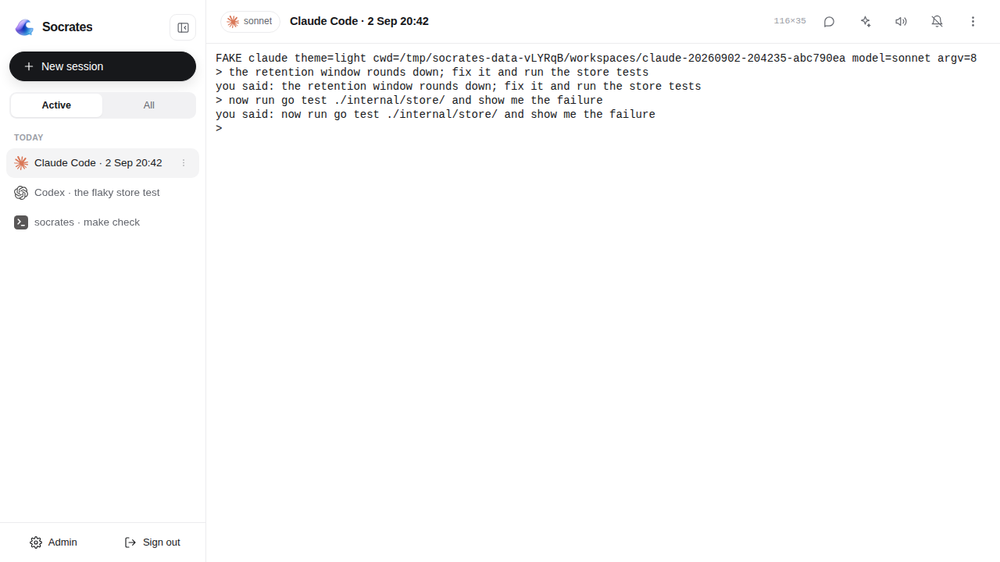
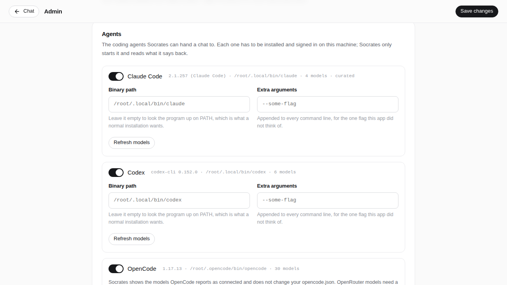
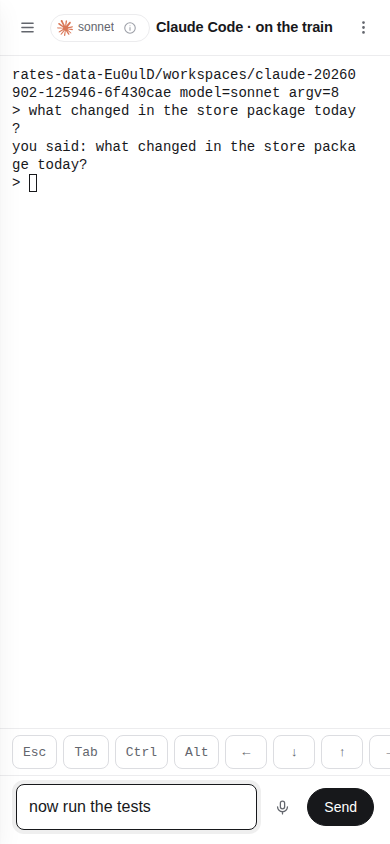
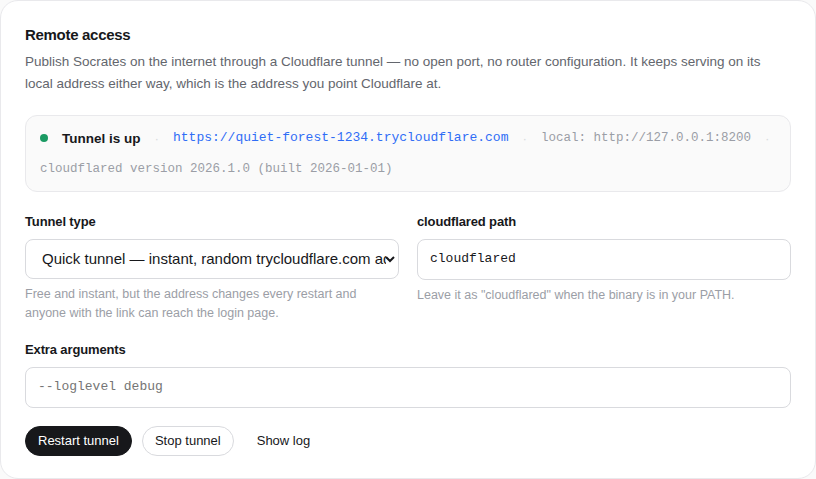

# Socrates

**A web terminal for Claude Code, Codex, OpenCode and your shell.**
One Go binary. Every session is a real terminal in a real tmux pane, and the
browser is a window onto it — so the session outlives the tab, the phone, the
network and Socrates itself.

<p align="center">
  
</p>

---

## Why

Claude Code, Codex and OpenCode are excellent, and they live in a terminal. That
is fine at a desk and useless everywhere else — on a phone, on a train, in a
car, on the sofa. Wrappers that fix this usually put a model of their own in
between, which paraphrases the CLI, guesses what it meant and gets in the way.

Socrates puts nothing in between. It starts the program exactly as you would
start it yourself, inside tmux, and gives you the pane: the real TUI, the real
keys, the real colours. What it adds is everything around the pane — the
session survives, the browser reconnects, the phone gets a key bar, and one
password guards the lot.

## What you get

- **Four kinds of session.** Shell, Claude Code, Codex and OpenCode. You pick
  the program, the directory and — for the three CLIs — the model and the
  reasoning effort when you start the session, and it keeps them for life.
- **The real terminal.** xterm.js in the browser, tmux behind it, no screen
  scraping and no translation layer. Anything that runs in a terminal runs
  here, alternate screen and mouse reporting included.
- **A session outlives everything except the machine.** Close the tab, lose
  signal, restart Socrates, upgrade the binary — the pane keeps running,
  because it belongs to a tmux server that is deliberately outside Socrates'
  lifecycle. Reopening reattaches to the screen as it is now.
- **A reboot is survivable too.** When the tmux server is gone, Socrates does
  not pretend: sessions go to *needs resume*, and opening one relaunches its
  program on the **conversation it already had** — `claude --resume`,
  `codex resume`, `opencode --session` — with a banner saying it came back and
  what it came back on.
- **Built for a bad connection.** Losing signal is normal, not an error. The
  connection bar says the moment the live view stops being live; the socket
  reconnects itself and replays the bytes that were missed, from a per-viewer
  ring, so the screen is continuous rather than cleared. What you type while it
  is down is delivered when it comes back, **exactly once**. The app shell even
  opens with no network at all.
- **Two devices on one session.** Open the same session on a laptop and a
  phone: both see the same pane, and the one whose window is smaller is told,
  once, that the size changed under it — Socrates owns the size rather than
  letting tmux shrink the pane to the smallest client.
- **A phone that can drive a TUI.** A key bar with `Esc`, `Tab`, sticky `Ctrl`
  and `Alt`, arrows, `^C`, `^D`, `^Z` and paste, plus a line input that sends a
  whole line with one `\r` — because autocorrect rewrites characters *after* a
  terminal has already sent them one at a time.
- **Dictation.** Record in the browser, transcribe through OpenRouter, and the
  words land in the line input **unsent**, for you to read before they reach a
  program that runs commands.
- **Reachable from anywhere, without opening a port.** A managed Cloudflare
  tunnel publishes the local server: a throwaway `trycloudflare.com` address in
  one click, or your own hostname with a tunnel token. `cloudflared` is
  downloaded for you if you do not have it.
- **A dashboard for everything.** Whether tmux is there (and a one-click
  installer if it is not), where sessions work, how the terminal behaves, every
  flag each CLI is started with, voice, remote access, password and a setup
  check.
- **Single binary.** Go plus embedded HTML/CSS/JS, SQLite for state, no build
  step, no CDN, no telemetry.

## How it works

```
   browser on this machine          browser anywhere
        │                                │
        │ http://localhost:8080          │ https://your-hostname
        │                                ▼
        │                         Cloudflare edge
        │                                │
        │                                ▼
        │                      cloudflared (child process)
        ▼                                │
  ┌─────────────────────────────────────────────────────────────┐
  │  socrates (single Go binary)                                │
  │    web UI · JSON API · WebSocket · SQLite state             │
  └───────────────┬─────────────────────────────────────────────┘
                  │  one `tmux attach` per viewer, on its own PTY
                  │  -S <data>/tmux.sock
  ┌───────────────▼─────────────────────────────────────────────┐
  │  tmux server — daemonized out of Socrates' process tree     │
  │  one session per Socrates session, named soc_<id>           │
  └───┬──────────────┬───────────────┬──────────────┬───────────┘
      ▼              ▼               ▼              ▼
   /bin/bash      claude          codex          opencode
   (login)        (TUI)           (TUI)          (TUI + its own
      │              │               │            loopback server)
      ▼              ▼               ▼              ▼
   your files    Anthropic        OpenAI        your OpenCode
                 (your login)     (your login)   provider
```

Socrates never speaks a CLI's protocol. It builds a command line, starts it in
a tmux pane, and moves bytes between that pane and your browser. The parts that
are Socrates' own are the ones a terminal cannot do for itself:

- **The size.** tmux sizes a window to the smallest attached client. Socrates
  therefore sizes the window itself, per session, and every viewer is told what
  the size became.
- **The white.** The pane is white, not "not black". tmux answers each CLI's
  own background query out of a window style Socrates sets, so a program that
  asks gets `light`; `COLORFGBG=0;15` covers the ones that do not ask; and
  xterm.js re-derives any colour that would be illegible at draw time.
- **The journal.** Every byte a pane prints is piped into a `socrates
  journal-sink` process — rotated, downloadable, and the record when a screen
  has been repainted.
- **The conversation id.** Each CLI keeps its session somewhere different, so
  Socrates learns it — Claude Code by choosing it up front, Codex by watching
  its rollout files, OpenCode by asking the TUI's own authenticated server —
  and that id is what a resume after a reboot is built on.

### The app shell works with no network

A service worker precaches everything the session page is made of, so Socrates
opens on a phone with no signal: the shell, the terminal engine and the styles
come from the cache, the connection bar says the truth about the network, and
nothing old is presented as current.

Measured on this build, the precached shell is **20 files, 1 069 KiB
uncompressed and 340 KiB gzipped** — of which the vendored terminal (xterm.js
and its five addons plus its stylesheet) is 788 KiB and 207 KiB. Adding a file
to `SHELL` in `internal/web/static/sw.js` adds to that number, and it is
recorded here so that an addition is noticed. Socrates serves the files as they
are; the compression is whatever is in front of it.

## Requirements

- **tmux 3.3 or newer.** Not optional and there is no fallback: a session *is*
  a tmux pane. If it is missing, the dashboard says so and offers to install it
  with this machine's own package manager (`apt-get`, `apk`, `dnf`, `yum`,
  `pacman`, `zypper` or `brew`), streaming the output into the page. The Docker
  image already has it.
- **A Unix-like system** — macOS or Linux (WSL counts). Socrates builds and
  runs on Windows, and the dashboard, the tunnel and voice work there, but
  **terminal sessions do not**: creating one, restarting one or opening its
  WebSocket is refused with `503` and a sentence that says so. Use the Docker
  image or WSL.
- **Go 1.25 or newer** — only to build the binary.
- **At least one CLI in your `PATH`, signed in already** — none of them if you
  only want a shell:
  [`claude`](https://claude.com/claude-code),
  [`codex`](https://github.com/openai/codex),
  [`opencode`](https://opencode.ai).
  Socrates does not log you in and holds no keys for them; run each one once in
  a terminal first.
- **An OpenRouter API key** — <https://openrouter.ai/keys>. Only dictation
  depends on it; without one, everything else works.
- **`piper`** — only on macOS, and only for the voice: it is the one thing
  Socrates cannot install for you there. One `brew install piper`.
- **`cloudflared`** — not required: if you turn on remote access and it is
  missing, Socrates downloads it for you.

## Install

```bash
git clone https://github.com/saschazesiger/SocratesAgent.git
cd SocratesAgent
make build
./socrates
```

Or without cloning:

```bash
go install github.com/saschazesiger/SocratesAgent@latest
SocratesAgent            # the binary takes the name of the repository
```

Or with Docker (the image brings tmux, the three CLIs, `cloudflared` and the
voice):

```bash
docker build -t socrates .
docker run -p 8080:8080 -v socrates-data:/data socrates
```

The CLIs still need their own credentials inside the container — mount your
`~/.claude`, `~/.codex` and `~/.config/opencode` into it, or sign in once in a
shell on the running container.

Each extra is a build argument, so you can leave out whatever you would rather
mount yourself or simply not carry:

```bash
docker build -t socrates --build-arg INSTALL_AGENTS=0 --build-arg INSTALL_VOICE=0 .
```

`INSTALL_AGENTS`, `INSTALL_CLOUDFLARED` and `INSTALL_VOICE` all default to `1`,
and `VERSION` — what `socrates -version` prints — defaults to `docker`. tmux is
not a build argument: without it the image would have nothing to run.

Then open <http://localhost:8080>.

## First run

1. `/setup` asks for the password you will use from now on. You can paste your
   OpenRouter key right away and decide whether the instance should be
   published through a Cloudflare tunnel — both can also be changed later.
2. You land in the dashboard. The first card says whether tmux is there; if it
   is not, **Install tmux** runs your package manager and streams the output.
   Press **Run checks** at the bottom for the rest: the workspace directory,
   each program and where its state lives, OpenRouter, voice, remote access and
   free disk.
3. Go back, press **New session**, pick a program and a directory, and start.

<p align="center">
  
</p>

## The four session types

A session is bound to one program at creation and keeps it for life. What each
one is started as:

| Session | Command line, in outline | Model | Effort |
| --- | --- | --- | --- |
| **Shell** | `$SHELL` (else `/bin/bash`, else `/bin/sh`), `-l` when "login shell" is on | — | — |
| **Claude Code** | `claude --session-id <uuid> …`, resumed with `--resume <id>` | `--model` | `--effort` |
| **Codex** | `codex --strict-config -C <dir> …`, resumed with `codex resume <id>` | `-m` | `-c model_reasoning_effort=…` |
| **OpenCode** | `opencode --port <free port> --hostname 127.0.0.1 … <dir>`, resumed with `--session <id>` | `-m` | as the model's *variant* |

**Where the models come from.** Codex and OpenCode are asked — `codex debug
models` and `opencode models` — so the picker offers what that installation
actually has. Claude Code has no such command, so Socrates ships a curated list
of the documented aliases, and the field also accepts anything you type, so a
new alias works the day it ships. Every program's card in the dashboard can
narrow that to a short list, each entry with the effort a new session starts on.

**Where a session works.** The dashboard has a workspace root (default
`<data>/workspaces`). A session gets its own directory below it, named after the
program and the moment it was created — or one of the preset directories an
administrator has named, or a path you type if that is allowed. Presets must
already exist and are never created; `/`, `/etc`, `/usr`, `/bin`, `/sbin`,
`/boot` and anything under `/proc`, `/sys` or `/dev` are refused. The rules are
enforced by the server, not by the sheet.

**Every flag is yours.** Each program's card in the dashboard is the whole
surface of its command line, grouped and with the exact flag or environment
variable in the hint under every control: permissions and sandboxing, providers,
isolation, remote control, session and prompt, extensions, tools, theme and
terminal, diagnostics, and raw extra flags, extra environment and config
overrides. They all take effect for sessions started from then on — a running
pane is never reconfigured behind your back.

## What survives what

| | the pane keeps running | the conversation continues |
| --- | --- | --- |
| Close the tab, lock the phone, lose signal | yes | yes |
| `socrates` restarted or upgraded | yes | yes |
| `systemctl restart socrates` | yes, with the shipped unit | yes |
| The machine reboots | no | yes — the resume path |
| The container is restarted | no | yes — the resume path |
| You delete the session | no | no, but the directory it worked in stays |

The tmux server is deliberately outside Socrates' lifecycle. Shutdown stops the
HTTP server, the tunnel and the viewers, and leaves every pane running; on
start, Socrates re-adopts what it finds, marks panes that died while it was away
as exited with their status, and takes in a `soc_*` session it does not know
rather than killing it.

Two deployment shapes follow from that:

- **systemd** — `deploy/socrates.service` ships with `KillMode=process`, because
  systemd's default would kill the tmux server along with Socrates and turn
  every ordinary restart into a reboot. Belt and braces, when `systemd-run` is
  available Socrates starts the tmux server in a transient scope of its own so
  it is outside the unit's cgroup as well.
- **Docker** — a container restart *is* a reboot: the tmux server dies with the
  container and sessions come back through the resume path. The image uses
  `tini` as its entrypoint so the tmux server, which reparents to PID 1, cannot
  become a zombie (`docker run --init` does the same from outside).

## On a phone

<p align="center">
  
</p>

The session list is a drawer, the sheet is a bottom sheet, and under the pane
there are two things a touch keyboard cannot do on its own:

- **The key bar** — `Esc`, `Tab`, `Ctrl`, `Alt`, the four arrows, `⏎`, `^C`,
  `^D`, `^Z`, paste and a keyboard toggle. `Ctrl` and `Alt` are sticky: tap to
  arm for the next letter, tap again to lock, tap again to clear.
- **The line input** — type a whole line, correct it, then send it with one
  `\r`. The microphone beside it dictates into the same field, and nothing is
  sent until you send it. A half-typed line survives a reload.

It appears by itself on a coarse pointer or a narrow window, and the session
menu can force it either way.

## Voice

- **Microphones need a secure context.** Browsers only allow recording on
  `localhost` or over HTTPS. On a server, put Socrates behind TLS or the
  Cloudflare tunnel, or the microphone will report that it is blocked.
- **Speech to text** goes through the transcription model chosen in the
  dashboard — an audio-capable chat model such as `google/gemini-2.5-flash`, or
  a dedicated transcriber such as `openai/gpt-transcribe`. The browser records
  raw PCM and sends a 16 kHz WAV, so no ffmpeg is involved.
- **Text to speech** is [Piper](https://github.com/rhasspy/piper), running on
  the same machine — no provider, no model, no API key. Socrates installs it and
  both voices by itself, and the Docker image has them baked in. On macOS it
  installs nothing and says so: those builds ship without the libraries their
  own binary loads, so `brew install piper` once and Socrates picks it up.
  **It is not wired into a terminal session** — a pane is a program, not an
  answer — so what the dashboard offers today is the installation itself, the
  language, the speaking rate and a **Test voice output** button.
- **Spoken language** is one setting, English or Deutsch, and it picks both the
  language a recording is transcribed into and the installed voice.
- The bundled engine ships GPL-3.0 and MIT components; what they are and where
  their source lives is in [THIRD_PARTY_LICENSES.md](THIRD_PARTY_LICENSES.md).

## Remote access

Socrates always serves on its local address — that never changes, and it is the
address you point Cloudflare at. On top of that it can run a
[Cloudflare tunnel](https://developers.cloudflare.com/cloudflare-one/connections/connect-networks/)
as a supervised child process, so the instance is reachable from the internet
without opening a port, forwarding anything on your router, or owning a static
IP.

<p align="center">
  
</p>

There is nothing to install by hand. If `cloudflared` is not on your `PATH`,
Socrates downloads the official build for your platform into `<data>/bin` the
moment you start a tunnel, checks that it runs, and uses it from then on. A
`cloudflared` that is already installed always wins, and an explicit path in the
settings is never overridden.

**Quick tunnel** — one click, no Cloudflare account. Cloudflare hands out a
random `https://….trycloudflare.com` address, which Socrates shows as soon as it
appears. It changes on every restart, and anyone with the link reaches your
login page, so treat it as a temporary demo door.

**Named tunnel** — your own hostname, your own account:

1. Zero Trust → Networks → Tunnels → **Create a tunnel** → *Cloudflared*.
2. Copy the token out of the install command Cloudflare shows and paste it into
   Socrates.
3. Add a public hostname for the tunnel and point it at the local address the
   dashboard displays (`http://localhost:8080` by default). This is exactly why
   Socrates keeps serving locally.
4. Enter the same hostname in Socrates, then press **Start tunnel**.

The tunnel is supervised: it restarts with backoff if `cloudflared` dies, comes
back when Socrates restarts, and is shut down cleanly on exit. The token is
passed through the environment, so it never shows up in the process list, and it
is redacted from the log tail in the dashboard.

## Configuration

| Flag | Environment | Default | Meaning |
| --- | --- | --- | --- |
| `-addr` | `SOCRATES_ADDR` | `:8080` | listen address; `127.0.0.1:8080` accepts local connections only |
| `-data` | `SOCRATES_DATA_DIR` | `~/.socrates` | database, tmux socket, journals and workspaces. Keep it short: two Unix sockets live in it, and a path over ~100 bytes is refused at start-up with a sentence saying so |
| `-version` | | | print the version and exit |
| | `OPENROUTER_API_KEY` | | seeds the key on first start |
| | `SOCRATES_WORKSPACE_ROOT` | `<data>/workspaces` | default workspace root |
| | `SOCRATES_PIPER_DIR` | | a Piper installation to use instead of the managed one; the Docker image sets it |

`socrates serve` is the same thing as plain `socrates`, for anyone who prefers
to say it out loud. Two more subcommands exist and are internal: `socrates
journal-sink` is what tmux pipes a pane's output into, and `socrates tmux-hook`
is what a tmux hook runs to tell Socrates a pane has died. Neither is something
to run by hand.

Inside the data directory:

```
<data>/socrates.db              SQLite: settings, sessions, logins, password hash
<data>/socrates.db.pre-v3.bak   one-time backup, if an older database was migrated
<data>/tmux.sock                the Socrates-owned tmux server (0700, in a 0700 directory)
<data>/tmux.conf                generated on every start
<data>/sessions/<id>/           the launch plan, the journal, generated CLI config
<data>/workspaces/              where sessions work, unless told otherwise
```

Everything else lives in the dashboard.

## Security

Socrates is built for a single trusted operator, and it runs the coding CLIs
**unattended**. That is the point of it — nobody can tap "allow" from a car —
and it is the thing to understand before you publish it.

- **Unattended means unattended, if you say so.** The permission and sandbox
  settings of each CLI are yours, in its card in the dashboard, with the flag
  each one maps to written under it, and the dangerous ones ask twice before
  they are saved. There are no approval cards in the pane's way; what the
  program is allowed to do is what you configured before it started.
- **The programs run as the user that runs Socrates**, with that user's files,
  credentials and network. Access to the web interface is therefore access to
  that account — treat the password accordingly, and put Cloudflare Access in
  front of the hostname if you publish it.
- One password, hashed with PBKDF2-HMAC-SHA256 (210 000 rounds), a session
  cookie that is `HttpOnly` and `SameSite=Lax` and becomes `Secure` as soon as
  the request arrives over HTTPS, and rate-limited logins — after five failures
  the delay grows to ten minutes, per client address. Changing the password
  signs every other browser out.
- Every state-changing request is checked for a same-origin `Origin`, and the
  WebSocket only accepts a handshake whose origin is the host it was served
  from.
- The tmux server has a socket of its own inside the data directory, which
  Socrates creates with `0700`, and every tmux command carries `-S`, so a
  session is not reachable by name from another program and Socrates never
  touches your own tmux server.
- OpenCode's TUI *is* an HTTP server. Socrates gives each session a random
  password for it, held in memory and never written to disk, and binds it to
  loopback.
- Socrates listens on every interface by default, so it works out of the box on
  a server, in Docker and behind a tunnel. Pass `-addr 127.0.0.1:8080` to accept
  local connections only and publish it exclusively through the tunnel.

## Development

```bash
make check       # exactly what CI runs: gofmt, go vet, go mod tidy, go test -race, go build
make fmt         # the one target that rewrites your files
make e2e         # the browser suite (needs node, a Chromium and tmux)
make vendor-xterm  # re-download the pinned xterm.js bundle set
```

The Go tests use **real tmux**, on a private socket under the test's own
temporary directory, and skip themselves when tmux is missing or older than 3.3.
They never touch your tmux server and never start a real CLI session; the
browser suite runs a fake TUI installed under all three CLI names, which writes
the same state files the real programs write and refuses the same way they
refuse. See [e2e/README.md](e2e/README.md).

Layout:

```
main.go                     flags, startup, shutdown, journal-sink and tmux-hook
internal/termux             the tmux substrate: sessions, viewers, sizing, journal, adoption
internal/harnesses          the four programs: command lines, config files, id discovery
internal/catalog            which programs are installed and which models they offer
internal/store              SQLite persistence (sessions, settings, logins)
internal/config             the settings document and its defaults
internal/server             HTTP API, auth, the WebSocket, admin, voice, tunnel
internal/openrouter         transcription and the model catalogue
internal/piper              the local voice: its installer and the renderer
internal/tunnel             supervised Cloudflare tunnel and its installer
internal/proc               process group helpers
internal/web/static         the whole front end: plain HTML, CSS and JS
e2e                         Playwright scenarios against a real server and real tmux
deploy/socrates.service     the systemd unit
```

The front end has no build step. Edit the files under `internal/web/static` and
rebuild the binary — that is all.

## License

MIT. See [LICENSE](LICENSE).

The local voice is not part of that: Piper, the libraries it ships with and the
two voice models carry their own licences, one of them GPL-3.0. tmux and the
coding CLIs are separate programs Socrates starts, each under its own terms.
They are named in [THIRD_PARTY_LICENSES.md](THIRD_PARTY_LICENSES.md), which
matters to anyone publishing the Docker image.
