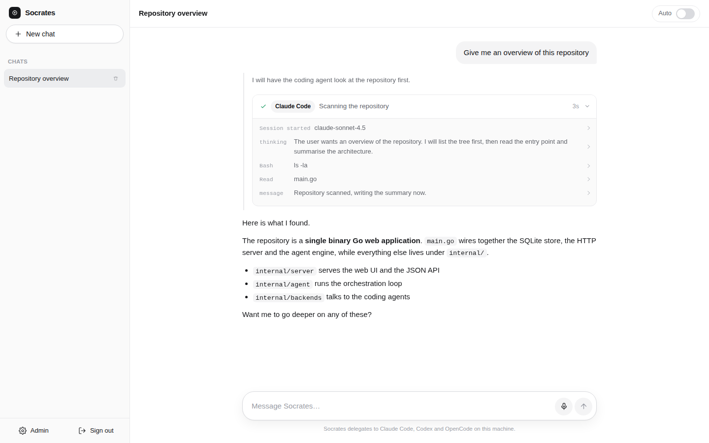
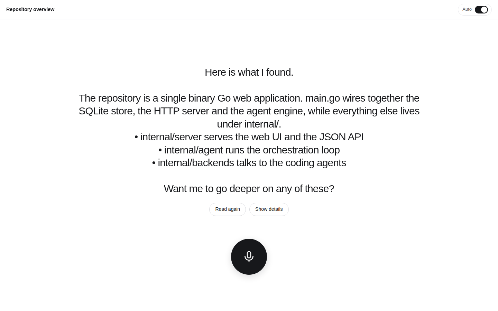

# Socrates

**A top level agent for Claude Code, Codex and OpenCode.**
One Go binary with a ChatGPT style web interface, a live view of what the coding
agents are doing, and a hands free voice mode. It thinks on
[OpenRouter](https://openrouter.ai) and does none of the work itself: it hands
every job to one of the agent CLIs you already have, at a real terminal on your
machine.

<p align="center">
  
</p>

---

## Why

Claude Code, Codex and OpenCode are excellent at doing the work. They are less
good at deciding *which* of them should do it, and they live in a terminal.

Socrates sits one level above them and stays there. It never writes a line of
code itself: it decides which agent should do the job, on which model and at
what reasoning effort, starts it at a terminal the way you would, types the
brief into it, reads the screen, answers what the agent asks, and waits for it
to finish. Even checking the work is delegated — it asks the agent to run the
tests and reads the output off the screen. When a decision is genuinely yours it
asks in its reply and hands the turn back, and it answers you in one place: by
text or by voice.

## What you get

- **A chat that feels familiar.** Sidebar with past conversations, streaming
  answers, markdown, mobile friendly. Light, quiet, minimal.
- **Archive instead of delete.** A conversation you are done with can be put
  away rather than thrown away: the transcript stays, everything it had running
  is closed, and the sidebar hides it until you switch it from **Active** to
  **All**. Writing to an archived chat makes it active again by itself.
- **A real terminal, not a wrapper.** Socrates opens interactive sessions and
  drives them like a person: typing, reading the screen, pressing keys. That is
  how it runs Claude Code, and equally how it runs anything else.
- **A live process view you can take over.** Every session is streamed to the
  browser as the screen it really is — and there is an input box, so you can
  type into the same program Socrates is talking to, at any moment.
- **Sessions that survive a restart.** Each one runs in its own small host
  process, so restarting Socrates does not interrupt an agent mid task; it
  reconnects to what was already running.
- **Built for a bad connection.** Losing signal is treated as normal, not as an
  error. A banner says the moment the live view stops being live and how old
  what you are looking at is — the chat, the terminal screens and the hands free
  display all stop pretending. The stream reconnects itself and replays exactly
  what was missed, so nothing quietly goes stale. Anything you send while the
  connection is gone — a message, a half typed draft — is kept and delivered when
  there is signal again, once and only once. The app even opens with no network
  at all, and picks up where it left off.
- **It asks you back.** When something is ambiguous the agent asks in its reply
  and stops, instead of guessing. You answer with the next message.
- **Voice in and out.** Record in the browser, transcribe through OpenRouter,
  have the answer read back by a voice that runs on the same machine as
  Socrates — no key, no account, no provider and nothing to choose. It
  installs itself on first start and is already in the Docker image.
- **Audio mode.** One big microphone button, a timer, and the answer shown as
  large as it fits and read out loud. When it ends on a question you hear it and
  simply speak your reply.
- **Reachable from anywhere, without opening a port.** A managed Cloudflare
  tunnel publishes the local server on the internet — a throwaway
  `trycloudflare.com` address in one click, or your own hostname with a tunnel
  token. `cloudflared` is downloaded automatically if you do not have it. Start,
  stop and watch it from the dashboard.
- **An admin dashboard for everything.** API key, a searchable picker over the
  live OpenRouter catalogue, the programs Socrates may run and how to drive
  them, prompts, voice, remote access, password, and a setup check.
- **Single binary.** Go plus embedded HTML/CSS/JS, SQLite for state, no build
  step, no CDN, no telemetry.

<p align="center">
  
</p>

## How it works

```
   browser on this machine          browser anywhere
        │                                │
        │ http://localhost:8080          │ https://your-hostname
        │                                ▼
        │                         Cloudflare edge
        │                                │
        │                                ▼
        │                      cloudflared (child process)
        ▼                                │
  ┌─────────────────────────────────────────────────────┐
  │  socrates (single Go binary)                        │
  │                                                     │
  │    web UI  ·  JSON API  ·  SSE  ·  SQLite state     │
  │                        │                            │
  │                orchestration loop                   │
  │                 │              │                    │
  └─────────────────┼──────────────┼────────────────────┘
                    │              │
          OpenRouter│              │unix socket
       plan, answer,│              │
         transcribe ▼              ▼
                            socrates term-host   (one per session,
                                    │             detached, survives
                                    ▼             a restart)
                            pseudo terminal
                                    │
                                    ▼
                            claude · codex · opencode · bash · anything
```

The orchestrator has one capability: a terminal. `terminal_open` /
`terminal_send` / `terminal_wait` / `terminal_read` / `terminal_close` are how
it drives the program that is actually doing the job, and `shell_run` is there
for orchestration mechanics only — is that process still alive, what is in this
directory — never for the work itself. When the decision is yours it simply asks
in its reply and ends its turn; your next message picks the conversation up
again.

Claude Code, Codex and OpenCode are not special cases in the code. They are
entries in a list, each one saying which command to start and — in plain
English — how to drive it. Adding a fourth is configuration, not a patch.

Every session runs behind a real pseudo terminal, so the agent CLIs show their
full interactive interface instead of dropping into a headless mode, and
Socrates reads the rendered screen exactly as a person would see it.

## Requirements

- **Go 1.24+** — only to build the binary.
- **An OpenRouter API key** — <https://openrouter.ai/keys>.
- **A Unix-like system** for the full experience — macOS, Linux, WSL. Socrates
  builds and runs on Windows, but without a pseudo terminal there, full screen
  CLIs fall back to their non interactive behaviour.
- **At least one agent CLI** in your `PATH`, signed in:
  [`claude`](https://claude.com/claude-code),
  [`codex`](https://github.com/openai/codex),
  [`opencode`](https://opencode.ai).
- **`cloudflared`** — not required: if you turn on remote access and it is
  missing, Socrates downloads it for you. See [Remote access](#remote-access).

## Install

```bash
git clone https://github.com/saschazesiger/SocratesAgent.git
cd SocratesAgent
make build
./socrates
```

Or without cloning:

```bash
go install github.com/saschazesiger/SocratesAgent@latest
SocratesAgent            # the binary takes the name of the repository
```

Or with Docker (the image also brings the three agent CLIs and the voice):

```bash
docker build -t socrates .
docker run -p 8080:8080 -v socrates-data:/data socrates
```

Then open <http://localhost:8080>.

## First run

1. `/setup` asks you for the password you will use from now on. You can paste
   your OpenRouter key right away, and decide whether the instance should be
   published through a Cloudflare tunnel — both can also be changed later.
2. You land in the admin dashboard. Check the skills, press **Run checks** — it
   verifies your key, the workspace directory, the terminal and every enabled
   skill.
3. Go back to the chat and ask for something.

<p align="center">
  
</p>

## Skills

A skill is a program Socrates knows how to operate the way a person does. Each
one answers two questions — *when should I use you?* and *how do I work you?* —
and both go into the model's instructions verbatim.

| Skill | Ships enabled | Good at |
| --- | --- | --- |
| Claude Code | yes | writing, refactoring and debugging code, careful multi step edits |
| Codex | yes | research, investigation, comparing options, writing up findings |
| OpenCode | no | an open source alternative implementer |

Skills are predefined by the app. How each one is started — its command, its
arguments, its environment, its permission flags — and the manual for driving
it come with the release: the screens right after launch and the keys that get
past them, where to type, how to tell working from idle, every dialog it can
show and the key that answers it, how to interrupt it and how to quit. They were
written by driving Claude Code 2.1.251, codex-cli 0.146.0 and opencode 1.17.13
in a terminal and writing down what they actually did.

In the dashboard a skill therefore has exactly three controls:

- **The switch** — whether Socrates may use this program at all.
- **When should Socrates use it?** — the one sentence that decides what it is
  reached for. Leave it empty for the wording that ships with the app.
- **Models it may run on** — the list Socrates picks from when it opens the
  session. Empty restores the list that ships with the app.

**Models.** Each row is a model in that program's own naming — `sonnet`,
`gpt-5.6-sol`, `opencode/big-pickle`, never an OpenRouter id — a reasoning
effort, and a sentence saying when that combination is the right one. Socrates
reads those sentences the same way it reads the skill descriptions and picks one
per session; the first row is what it gets when it does not pick. How the two
values reach the program is not yours to configure, because it is a property of
the program, and each card prints the mechanism it uses:

| Skill | Model | Reasoning effort |
| --- | --- | --- |
| Claude Code | `--model <id>` | `--effort <level>` |
| Codex | `-m <slug>` | `-c model_reasoning_effort="<level>"` |
| OpenCode | `-m provider/model` | no launch-time form — it calls them *variants* and they are picked inside the running program with `/variants` |

Everything else is not a setting, and that is the point: when a new version
improves a manual, fixes a command line or teaches a skill a new dialog, every
installation gets the improvement on upgrade instead of keeping a copy of the
old one. Upgrading an installation that predates this keeps your switches and
any description you wrote yourself; skills you had added by hand are dropped,
and the server log names them on the first start.

A skill is the only way work gets done. There is a shell as well, but it is for
orchestration mechanics — checking whether something is running, looking at a
directory so the brief names the right paths — and the system prompt says so in
as many words: no builds, no test runs, no edits. With no skill enabled Socrates
will tell you to enable one in the dashboard rather than roll up its sleeves.
Being able to write your own skills may come back in a future version.

**Interactive only.** The shipped skills are interactive only: Socrates may open
them in a terminal session and nowhere else. That is the point of the app — you
are watching that terminal and can take the keyboard at any moment, which a
batch run would hide from you. Each skill also names its program's headless
modes (`claude -p`, `codex exec`, `opencode run` …) so the orchestrator knows
exactly what not to reach for.

**Permissions.** Every skill starts in its own unattended mode —
`--dangerously-skip-permissions` for Claude Code,
`--dangerously-bypass-approvals-and-sandbox` for Codex, `--auto` for OpenCode —
which is what makes long tasks work without babysitting. Claude Code also ships
with `IS_SANDBOX=1`, because it refuses to skip permissions when it runs as root
— the normal case in a container — unless it is told it is already confined.

**Where they run.** The admin dashboard has a workspace root (default
`~/.socrates/workspaces`); every chat gets its own directory below it, so chats
stay isolated. A chat can also be pinned to an existing project directory
through `PATCH /api/chats/{id}` with a `workspace` field.

**Sessions.** A session belongs to its chat, not to a single message: an agent
you started while asking one thing is still there for the next thing, and a long
build keeps running while you talk. Sessions live in their own host processes,
so they survive a restart of Socrates and are reconnected on the way back up.
They end when you close them, when the program exits, or when the chat is
archived or deleted.

**Taking over.** Every session shown in the chat has an input box and a row of
key buttons. Whatever you type goes to the same program Socrates is driving, so
you can answer a prompt yourself, correct a wrong turn, or just watch.

## Choosing models

Two different kinds of model live in the dashboard, and they are not
interchangeable. Everything Socrates itself asks a model for — answering,
transcription and titles — is an OpenRouter model, and there is no second
source to choose from: no base URL, no endpoint of your own, no key besides the
one at the top. Each is picked with a searchable dropdown over the live
OpenRouter catalogue, grouped by provider and annotated with context length and
price, filtered down to the models that can do that particular job. The list is
fetched when the dashboard opens; OpenRouter serves it without a key, so it
works before you have pasted one, and every field still accepts anything you
type.

The voice that reads an answer out loud is not on that list at all. It is not
a model, it is not on OpenRouter, and there is nothing to pick: it runs on your
own machine — see **Voice** below.

The models on a skill card are the coding agent's own, and they never go through
OpenRouter: Claude Code, Codex and OpenCode each talk to their own provider with
their own credentials, so a row there is a name that program understands —
`opus`, `gpt-5.6-sol`, `opencode/big-pickle` — typed by hand. See **Skills**
above.

## Voice

- **Microphones need a secure context.** Browsers only allow recording on
  `localhost` or over HTTPS. If you run Socrates on a server, put it behind a
  TLS reverse proxy, otherwise the microphone button will report that it is
  blocked.
- **Speech to text** goes through the transcription model chosen in the
  dashboard — an audio capable chat model such as `google/gemini-2.5-flash`, or
  a dedicated transcriber such as `openai/whisper-1`. Socrates works out which
  of the two endpoints a model lives at and remembers it. The browser records
  raw PCM and sends a 16 kHz WAV, so no ffmpeg is involved.
- **Text to speech** is one voice, running on the server, and there is nothing
  to configure: no provider, no model, no voice name, no API key and no
  account. Socrates installs [Piper](https://github.com/rhasspy/piper) and the
  voice for your language by itself the first time it starts — the Voice card
  in the dashboard shows the download while it runs — and the Docker image
  already has both baked in, so a container reads the first answer it is given.
  German is `de_DE-thorsten-medium`, English is `en_US-ljspeech-medium`, and
  the spoken language below is what picks between them.
  - **It sounds synthetic**, clearly so, and it is completely intelligible.
    That is the trade: a small neural model on your own CPU instead of a voice
    that is indistinguishable from a person and belongs to somebody else.
  - **It is fast.** Roughly ten times faster than real time on an ordinary CPU
    — 445 characters of German became 24 seconds of audio in 1.5 seconds — so
    the answer starts almost as soon as it is written.
  - **It costs nothing**, per character or otherwise, and it needs no
    connection to a third party at any point. What it needs is one download of
    about 150 MB — the engine and both voices — and only the first time.
  - The bundled engine ships GPL-3.0 and MIT components; what they are and
    where their source lives is in
    [THIRD_PARTY_LICENSES.md](THIRD_PARTY_LICENSES.md).
- **Spoken language** is one setting in the admin dashboard, English or
  Deutsch, and it covers everything Socrates says: which language your
  recording is transcribed into, which installed voice reads the answer out
  loud, and which language the agent writes its answers in. Getting this wrong
  is what makes a German answer come out with an English accent. English is the
  default; there is no detection and nothing to configure per chat.

## Audio mode

The top bar has one slider for what the pane shows — **Chat**, **Chat +
Terminal**, **Terminal**, **Audio** — and only one of them at a time. Its last
stop turns the chat into a hands free surface: a large microphone button with a
recording timer, a short status line while the agents work, and the finished
answer shown as large as it fits and read out loud. If the agent needs a
decision it asks for it in that answer, which is read out with the rest — you
tap the microphone and say what you want.

## Remote access

Socrates always serves on its local address — that never changes, and it is the
address you point Cloudflare at. On top of that it can run a
[Cloudflare tunnel](https://developers.cloudflare.com/cloudflare-one/connections/connect-networks/)
as a supervised child process, so the instance is reachable from the internet
without opening a port, forwarding anything on your router, or owning a static
IP.

<p align="center">
  
</p>

There is nothing to install by hand. If `cloudflared` is not on your `PATH`,
Socrates downloads the official build for your platform from Cloudflare's
release page into `<data>/bin/cloudflared` the moment you start a tunnel, checks
that it runs, and uses it from then on. The dashboard shows the download
progress and has a **Download cloudflared** button if you want it ready
beforehand. A `cloudflared` that is already installed always wins, and an
explicit path in the settings is never overridden.

Pick one of two modes in **Admin → Remote access** (or right in the setup
wizard):

**Quick tunnel** — one click, no Cloudflare account. Cloudflare hands out a
random `https://….trycloudflare.com` address, which Socrates shows as soon as it
appears. The address changes on every restart, and anyone who has the link
reaches your login page, so treat it as a temporary demo door.

**Named tunnel** — your own hostname, your own Cloudflare account:

1. Zero Trust → Networks → Tunnels → **Create a tunnel** → *Cloudflared*.
2. Copy the token out of the install command it shows you and paste it into
   Socrates.
3. Add a public hostname for the tunnel and point it at the local address that
   the admin dashboard displays (`http://localhost:8080` by default). This is
   exactly why Socrates keeps serving locally.
4. Enter the same hostname in Socrates so it can link you to it, then press
   **Start tunnel**.

The tunnel is supervised: it restarts with backoff if `cloudflared` dies, it
comes back automatically when Socrates restarts, and it is shut down cleanly on
exit. The token is passed through the environment, so it never shows up in the
process list, and it is redacted from the log tail in the dashboard.

## Configuration

| Flag | Environment | Default | Meaning |
| --- | --- | --- | --- |
| `-addr` | `SOCRATES_ADDR` | `:8080` | listen address; use `127.0.0.1:8080` to accept local connections only |
| `-data` | `SOCRATES_DATA_DIR` | `~/.socrates` | database and workspaces |
| `-version` | | | print the version |
| | `SOCRATES_SHELL` | `$SHELL` | the shell a bare terminal session starts |
| | `OPENROUTER_API_KEY` | | seeds the key on first start |
| | `SOCRATES_PIPER_DIR` | | a Piper installation to use instead of the managed one; the Docker image sets it |
| | `SOCRATES_WORKSPACE_ROOT` | `<data>/workspaces` | default workspace root |

Everything else lives in the admin dashboard and is stored in
`<data>/socrates.db` — a single SQLite file that holds settings, chats,
messages, every process step and your password hash.

## Security

Socrates is built for a single trusted operator.

- One password, hashed with PBKDF2-HMAC-SHA256 (210k rounds), a session cookie
  that is `HttpOnly` and `SameSite=Lax`, and rate limited logins.
- Socrates has a shell and runs **as the user that runs Socrates**, with the
  coding agents unattended by default. Access to the web interface is access to
  that shell — treat the password accordingly, and put Cloudflare Access in
  front of the hostname if you publish it.
- Socrates listens on every interface by default, so it works out of the box on
  a server, in Docker and behind a tunnel. Pass `-addr 127.0.0.1:8080` (or set
  `SOCRATES_ADDR`) to accept local connections only and publish it exclusively
  through the Cloudflare tunnel.
- Requests through a tunnel are rate limited per `CF-Connecting-IP`, and the
  session cookie is marked `Secure` as soon as the request arrives over HTTPS.
- Terminal sessions are reachable only through the authenticated API, are scoped
  to the chat that opened them, and talk to their host process over a unix
  socket inside the data directory.

## Development

```bash
make check       # gofmt, go vet, go test, go build
go test ./...    # unit tests, a scripted interactive CLI driven through a real
                 # pseudo terminal, and an end to end agent loop against a mock
```

Layout:

```
main.go                  flags, startup, graceful shutdown
internal/config          settings document and defaults
internal/store           SQLite persistence (chats, runs, steps, messages)
internal/openrouter      streaming chat completions, models, audio
internal/piper           the local voice: its installer and the renderer
internal/term            pseudo terminals, screen rendering, session hosts
internal/agent           the orchestration loop, tools, event bus
internal/server          HTTP API, auth, SSE, admin, voice, terminals
internal/tunnel          supervised Cloudflare tunnel and its installer
internal/proc            process group helpers
internal/web/static      the whole front end: plain HTML, CSS and JS
```

The front end has no build step. Edit the files under `internal/web/static` and
rebuild the binary — that is all.

## License

MIT. See [LICENSE](LICENSE).

The local voice is not part of that: Piper, the libraries it ships with and the
two voice models carry their own licences, one of them GPL-3.0. They are named
in [THIRD_PARTY_LICENSES.md](THIRD_PARTY_LICENSES.md), which matters to anyone
publishing the Docker image.
