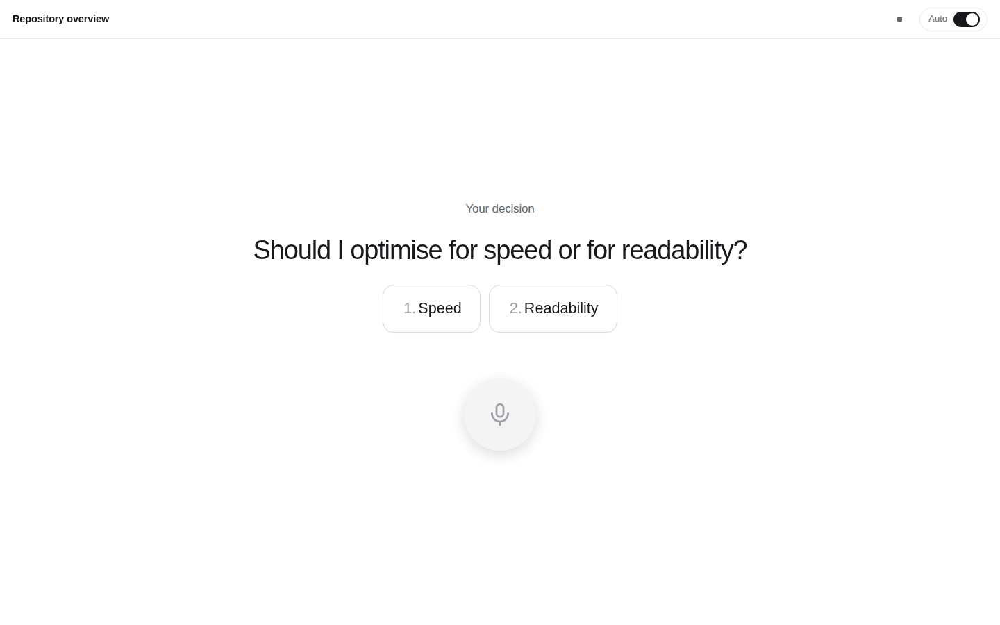

# Socrates

**A top level agent for Claude Code, Codex and OpenCode.**
One Go binary with a ChatGPT style web interface, a live view of what the coding
agents are doing, and a hands free voice mode. It runs entirely on
[OpenRouter](https://openrouter.ai) and delegates the actual work to the agent
CLIs already installed on your machine.

<p align="center">
  
</p>

---

## Why

Claude Code, Codex and OpenCode are excellent at doing the work. They are less
good at deciding *which* of them should do it, and they live in a terminal.

Socrates sits one level above them: you talk to it, it plans, it hands complete
briefs to the right agent, it waits for the agent to finish, it asks you when a
decision is genuinely yours, and it answers you in one place — by text or by
voice.

## What you get

- **A chat that feels familiar.** Sidebar with past conversations, streaming
  answers, markdown, mobile friendly. Light, quiet, minimal.
- **A real agent loop, not a single request.** Socrates keeps calling itself,
  delegating and refining, until the job is done.
- **A live process view.** Every delegation shows the agent's reasoning, every
  tool call, every shell command and its output — and it is persisted, so a page
  refresh restores the exact state, mid run.
- **It asks you back.** When something is ambiguous the agent offers two to four
  options as buttons instead of guessing.
- **Voice in and out.** Record in the browser, transcribe through OpenRouter,
  have the answer read back to you.
- **Auto mode.** One big microphone button, a timer, and the answer shown as
  large as it fits and read out loud. Options are spoken and can be answered by
  voice or by tapping.
- **Reachable from anywhere, without opening a port.** A managed Cloudflare
  tunnel publishes the local server on the internet — a throwaway
  `trycloudflare.com` address in one click, or your own hostname with a tunnel
  token. `cloudflared` is downloaded automatically if you do not have it. Start,
  stop and watch it from the dashboard.
- **An admin dashboard for everything.** API key, models, agents, when each
  agent should be used, prompts, voice, remote access, password, and a setup
  check.
- **Single binary.** Go plus embedded HTML/CSS/JS, SQLite for state, no build
  step, no CDN, no telemetry.

<p align="center">
  
  
</p>

## How it works

```
   browser on this machine          browser anywhere
        │                                │
        │ http://localhost:8080          │ https://your-hostname
        │                                ▼
        │                         Cloudflare edge
        │                                │
        │                                ▼
        │                      cloudflared (child process)
        ▼                                │
  ┌─────────────────────────────────────────────────────┐
  │  socrates (single Go binary)                        │
  │                                                     │
  │    web UI  ·  JSON API  ·  SSE  ·  SQLite state     │
  │                        │                            │
  │                orchestration loop                   │
  │                 │              │                    │
  └─────────────────┼──────────────┼────────────────────┘
                    │              │
          OpenRouter│              │child processes
       plan, answer,│              │
         transcribe ▼              ▼
                            claude -p --output-format stream-json
                            codex exec --json
                            opencode run --format json
```

The orchestrator has exactly two tools: `delegate_to_agent` and `ask_user`.
Which agent it picks is decided by the descriptions you write in the admin
dashboard, so routing is configuration, not code.

## Requirements

- **Go 1.24+** — only to build the binary.
- **An OpenRouter API key** — <https://openrouter.ai/keys>.
- **At least one agent CLI** in your `PATH`, signed in:
  [`claude`](https://claude.com/claude-code),
  [`codex`](https://github.com/openai/codex),
  [`opencode`](https://opencode.ai).
- **`cloudflared`** — not required: if you turn on remote access and it is
  missing, Socrates downloads it for you. See [Remote access](#remote-access).

## Install

```bash
git clone https://github.com/saschazesiger/SocratesAgent.git
cd SocratesAgent
make build
./socrates
```

Or without cloning:

```bash
go install github.com/saschazesiger/SocratesAgent@latest
SocratesAgent            # the binary takes the name of the repository
```

Or with Docker (the image also installs the three agent CLIs):

```bash
docker build -t socrates .
docker run -p 8080:8080 -v socrates-data:/data socrates
```

Then open <http://localhost:8080>.

## First run

1. `/setup` asks you for the password you will use from now on. You can paste
   your OpenRouter key right away, and decide whether the instance should be
   published through a Cloudflare tunnel — both can also be changed later.
2. You land in the admin dashboard. Check the agents, press **Run checks** — it
   verifies your key, the workspace directory and every enabled agent CLI.
3. Go back to the chat and ask for something.

<p align="center">
  
</p>

## Configuring the agents

Each agent has a description that answers one question: *when should Socrates
use you?* That text is handed to the model verbatim, so write it the way you
would brief a colleague.

| Agent | Ships enabled | Good at |
| --- | --- | --- |
| Claude Code | yes | writing, refactoring and debugging code, careful multi step edits |
| Codex | yes | research, investigation, comparing options, writing up findings |
| OpenCode | no | an open source alternative implementer |

You can add more entries — several profiles of the same CLI with different
models, flags or working directories, or a completely custom command
(type `custom`, with `{{prompt}}` where the task text should go).

**Where they run.** The admin dashboard has a workspace root (default
`~/.socrates/workspaces`); every chat gets its own directory below it, so chats
stay isolated. A chat can also be pinned to an existing project directory
through `PATCH /api/chats/{id}` with a `workspace` field.

**Permissions.** By default delegated agents run unattended, which is what makes
long tasks work without babysitting. Switch an agent to *Ask me in the web
interface* and Claude Code will route every tool call through Socrates: the
request appears as a card in the chat, the run pauses, and your answer is sent
back through a built in MCP bridge (`socrates bridge`). Codex and OpenCode fall
back to a restrictive sandbox in that mode, because their headless modes cannot
ask.

## Voice

- **Microphones need a secure context.** Browsers only allow recording on
  `localhost` or over HTTPS. If you run Socrates on a server, put it behind a
  TLS reverse proxy, otherwise the microphone button will report that it is
  blocked.
- **Speech to text** goes through an audio capable OpenRouter chat model
  (`google/gemini-2.5-flash` by default). The browser records raw PCM and sends
  a 16 kHz WAV, so no ffmpeg is involved. You can also point Socrates at any
  OpenAI compatible `/audio/transcriptions` endpoint.
- **Text to speech** uses the browser's own speech synthesis by default, which
  needs no key and no network. For a better voice, configure any OpenAI
  compatible `/audio/speech` endpoint in the admin dashboard.

## Auto mode

The toggle in the top right turns the chat into a hands free surface: a large
microphone button with a recording timer, a short status line while the agents
work, and the finished answer shown as large as it fits and read out loud. If
the agent needs a decision, the question and its options fill the screen and are
spoken — you can tap an option or simply say "the second one".

## Remote access

Socrates always serves on its local address — that never changes, and it is the
address you point Cloudflare at. On top of that it can run a
[Cloudflare tunnel](https://developers.cloudflare.com/cloudflare-one/connections/connect-networks/)
as a supervised child process, so the instance is reachable from the internet
without opening a port, forwarding anything on your router, or owning a static
IP.

<p align="center">
  
</p>

There is nothing to install by hand. If `cloudflared` is not on your `PATH`,
Socrates downloads the official build for your platform from Cloudflare's
release page into `<data>/bin/cloudflared` the moment you start a tunnel, checks
that it runs, and uses it from then on. The dashboard shows the download
progress and has a **Download cloudflared** button if you want it ready
beforehand. A `cloudflared` that is already installed always wins, and an
explicit path in the settings is never overridden.

Pick one of two modes in **Admin → Remote access** (or right in the setup
wizard):

**Quick tunnel** — one click, no Cloudflare account. Cloudflare hands out a
random `https://….trycloudflare.com` address, which Socrates shows as soon as it
appears. The address changes on every restart, and anyone who has the link
reaches your login page, so treat it as a temporary demo door.

**Named tunnel** — your own hostname, your own Cloudflare account:

1. Zero Trust → Networks → Tunnels → **Create a tunnel** → *Cloudflared*.
2. Copy the token out of the install command it shows you and paste it into
   Socrates.
3. Add a public hostname for the tunnel and point it at the local address that
   the admin dashboard displays (`http://localhost:8080` by default). This is
   exactly why Socrates keeps serving locally.
4. Enter the same hostname in Socrates so it can link you to it, then press
   **Start tunnel**.

The tunnel is supervised: it restarts with backoff if `cloudflared` dies, it
comes back automatically when Socrates restarts, and it is shut down cleanly on
exit. The token is passed through the environment, so it never shows up in the
process list, and it is redacted from the log tail in the dashboard.

> **Put Cloudflare Access in front of it.** A published Socrates is a password
> away from a shell on your machine, because delegate agents run commands
> unattended by default. Adding an Access policy (or switching the agents to
> *Ask me in the web interface*) turns that from a risk into a setup.

## Configuration

| Flag | Environment | Default | Meaning |
| --- | --- | --- | --- |
| `-addr` | `SOCRATES_ADDR` | `:8080` | listen address; use `127.0.0.1:8080` to accept local connections only |
| `-data` | `SOCRATES_DATA_DIR` | `~/.socrates` | database and workspaces |
| `-version` | | | print the version |
| | `OPENROUTER_API_KEY` | | seeds the key on first start |
| | `SOCRATES_WORKSPACE_ROOT` | `<data>/workspaces` | default workspace root |

Everything else lives in the admin dashboard and is stored in
`<data>/socrates.db` — a single SQLite file that holds settings, chats,
messages, every process step and your password hash.

## Security

Socrates is built for a single trusted operator.

- One password, hashed with PBKDF2-HMAC-SHA256 (210k rounds), a session cookie
  that is `HttpOnly` and `SameSite=Lax`, and rate limited logins.
- Delegated agents run **as the user that runs Socrates**, with auto approval by
  default. Treat access to the web interface as access to a shell.
- Socrates listens on every interface by default, so it works out of the box on
  a server, in Docker and behind a tunnel. Pass `-addr 127.0.0.1:8080` (or set
  `SOCRATES_ADDR`) to accept local connections only and publish it exclusively
  through the Cloudflare tunnel.
- Requests through a tunnel are rate limited per `CF-Connecting-IP`, and the
  session cookie is marked `Secure` as soon as the request arrives over HTTPS.
- The permission bridge only accepts requests carrying a token that is generated
  fresh at every start and never leaves the machine.

## Development

```bash
make check       # gofmt, go vet, go test, go build
go test ./...    # unit tests plus an end to end agent loop against a mock
```

Layout:

```
main.go                  flags, startup, graceful shutdown
internal/config          settings document and defaults
internal/store           SQLite persistence (chats, runs, steps, questions)
internal/openrouter      streaming chat completions, models, audio
internal/backends        spawn the agent CLIs, normalise their event streams
internal/agent           the orchestration loop, tools, event bus
internal/server          HTTP API, auth, SSE, admin, voice
internal/tunnel          supervised Cloudflare tunnel and its installer
internal/bridge          MCP server for interactive permissions
internal/proc            process group helpers shared by both
internal/web/static      the whole front end: plain HTML, CSS and JS
```

The front end has no build step. Edit the files under `internal/web/static` and
rebuild the binary — that is all.

## License

MIT. See [LICENSE](LICENSE).
